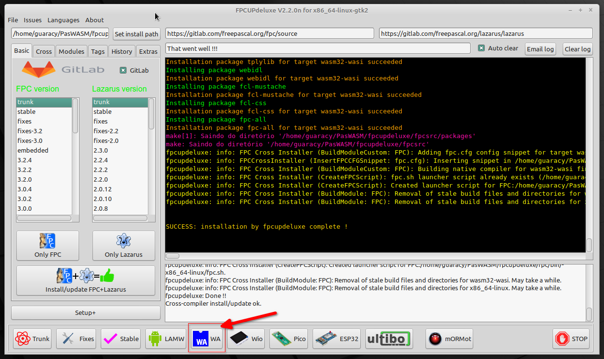
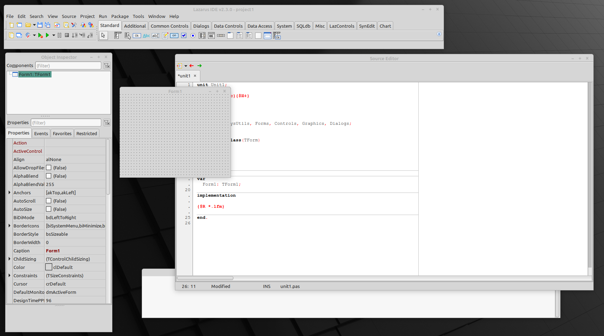
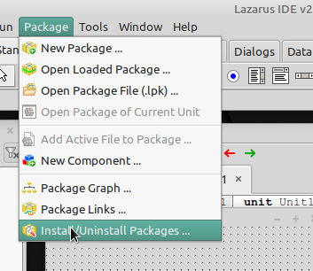
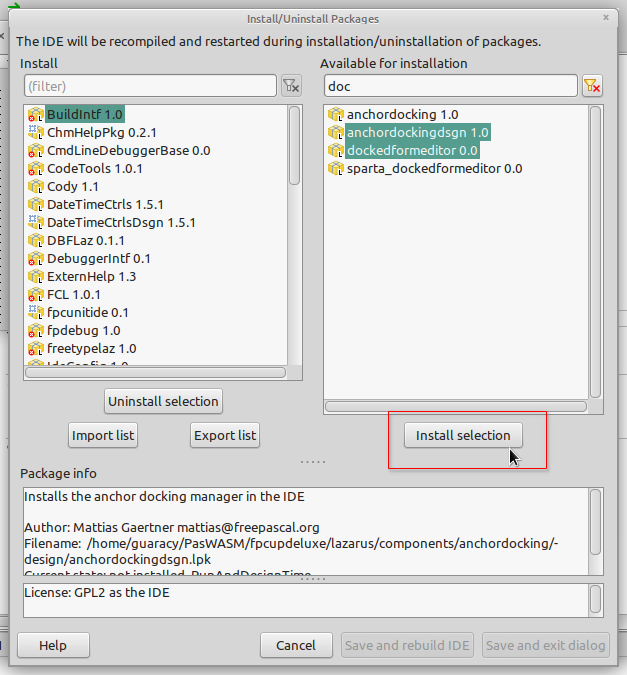
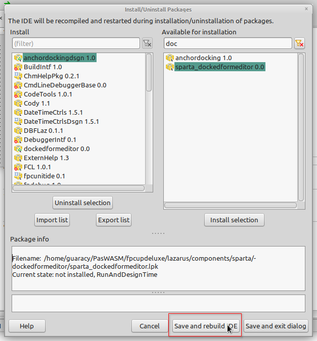
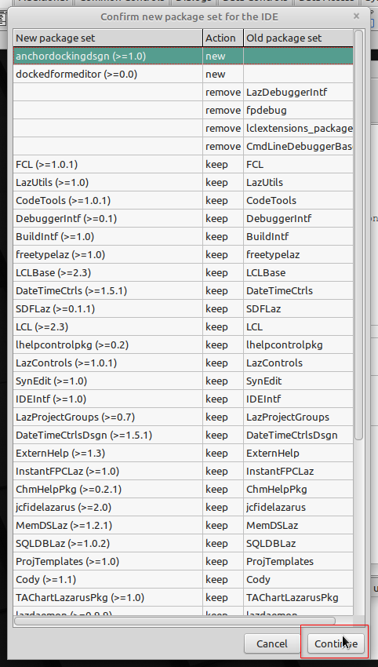
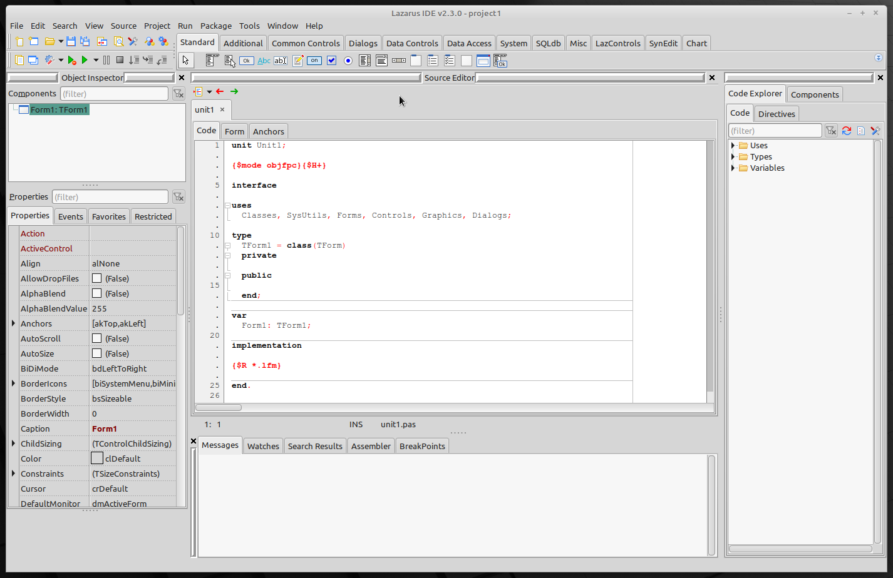

# Instalação

Caso você já possua o Lazarus instalado, pode seguir as opções
existentes na página [pas2js](https://wiki.freepascal.org/pas2js) e
pular para a próxima página. Pessoalmente, acho mais fácil utilizar o
fpcupdeluxe que bastam alguns cliques para que as coisas funcionem.

# fpcupdeluxe

### TL;DR;
Crie um diretório, baixe o
[fpcupdeluxe](https://github.com/LongDirtyAnimAlf/fpcupdeluxe/releases/latest),
execute, clique no botão WA e aguarde o final da instalação.

Com o [fpcupdeluxe](https://github.com/LongDirtyAnimAlf/fpcupdeluxe) é
possível instalar o Lazarus e outras diversas opções de forma
simples. Caso você ainda não tenha o Lazarus instalado é interessante
ler os requisitos necessários para que a instalação seja bem
sucedida. Siga os seguintes passos:

1. Crie um diretório (e.g. PasWASM)
2. Baixe a [última
versão](https://github.com/LongDirtyAnimAlf/fpcupdeluxe/releases/latest)
do fpcupdeluxe e coloque no diretório criado. Só tome cuidado para
baixar a versão para o seu SO.
3. Dê permissões de execução se for o caso (`chmod +x fpcupdeluxe`)
4. Execute o programa `./fpcupdeluxe`
5. Escolha o botão inferior *WA*
6. O programa irá criar os diretórios, baixar e compilar o programas
   necessários.
7. Feche o programa e renomeie o ícone criado no desktop
   (e.g. PasWASM). 

# Janela única

Como padrão, o Lazarus é instalado com as janelas todas soltas. 

Não é tão ruim de trabalhar mas eu prefiro a IDE em uma única
janela. Acho que o Lazarus deveria vir no modo janela única ou, pelo
menos, ter uma opção no menu *Windows* para facilitar o processo assim
como no GIMP. Como eu não gosto daquele monte de janelas espalhadas
pelo monitor, a primeira coisa que eu faço é instalar os pacotes
necessários para que fique em uma janela. 

Acesse a opção *Install/Uninstall Packages ...* do menu *Packages*

Selecione os pacotes *anchordockingdsgn 1.0* e *dockedformeditor 0.0*
e clique em *Install Selection*.

Clique no botão *Save and rebuild IDE*

Na próxima janela, clique em *Continue*

Em pouco tempo você terá uma nova IDE. Eu acho melhor de
trabalhar.

Agora é só deixar a IDE do seu gosto. Alguns exemplos de como
configurar a aparência da IDE podem ser encontradas
[aqui](https://github.com/FlKo/LazarusDockedDesktops). Se você é
iniciante, pule a parte onde tem *New StudioPlus Desktops*.

Atualmente estou usando a fonte [JetBrains
Mono](https://www.jetbrains.com/lp/mono/). É free e open source.

Também acho que os temas fornecidos com a distribuição deixam um
pouco a desejar. Alguns
[temas](https://wiki.lazarus.freepascal.org/UserSuppliedSchemeSettings)
que você pode instalar. Baixe os temas desejados (arquivo *.xml*) e
copie para `~/PasWASM/fpcupdeluxe/config_lazarus/userschemes`
(provavelmente deverá criar o diretório *userschemes*). Para utilizar
os novos temas você deverá reinicializar o Lazarus.

Era isso. O ambiente já está pronto para ser utilizado. 
