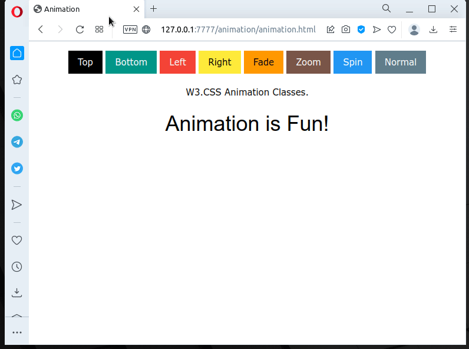

# Animação

Criei um novo projeto, optei por salvar todos (`Ctrl+Shift+S`) e
escolhi os nomes `animation.lpi` e `animation.html`.

Vamos ver como conseguir o resultado que segue:




#### HTML

Me baseei no
[exemplo](https://www.w3schools.com/w3css/w3css_animate.asp) do W3CSS
para o primeiro exemplo. O arquivo `animation.html` ficou assim:

``` html linenums="1"
<!doctype html>
<html lang="en">
<head>
  <meta http-equiv="Content-type" content="text/html; charset=utf-8">
  <title>Animation</title>
  <meta name="viewport" content="width=device-width, initial-scale=1">
  <link rel="stylesheet" href="https://www.w3schools.com/w3css/4/w3.css">
  <script src="animation.js"></script>
</head>
<body>
  <div class="w3-container w3-margin w3-center ">
    <div class="w3-bar">
      <button id="id_animate1" class="w3-button w3-black">Top</button>
      <button id="id_animate2" class="w3-button w3-teal">Bottom</button>
      <button id="id_animate3" class="w3-button w3-red">Left</button>
      <button id="id_animate4" class="w3-button w3-yellow">Right</button>
      <button id="id_animate5" class="w3-button w3-orange">Fade</button>
      <button id="id_animate6" class="w3-button w3-brown">Zoom</button>
      <button id="id_animate7" class="w3-button w3-blue">Spin</button>
      <button id="id_animate8" class="w3-button w3-blue-gray">Normal</button>
    </div>
    <p>W3.CSS Animation Classes.</p>
    <div id="id_anim">
      <h1 id="id_text" >Animation is Fun!</h1>
    </div>
  </div>
  <script>
    window.addEventListener("load", rtl.run);
  </script>
</body>
</html>

```

Diferenças da página gerada originalmente:

- Incluí a linha 7 para carregar o framework w3css e utilizá-lo na
  página. Outros exemplos serão com bulma, bootstrap, etc. Sem eles é
  necessário um conhecimento e tempo maior para o desenvolvimento de
  uma página apresentável.
- Na linha 8 tive que atualizar o nome do script gerado pelo Pascal
  (continuava como `project1.js`.
- Incluí as linhas de 11 a 26 para a criação da página com os botẽs e
  textos.
- Informei o `id` para todos os elementos que eu queria
  interagir. Numerei os botões de 1 a 8 para facilitar a programação.
  
Note que a única necessidade foi a inclusão dos `ids`. Nos botões nem
é necessário indicar um evento `on-click`.

#### Programa em Pascal

Agora a parte que interessa que é o que vamos programar.

A classe da aplicação ficou assim (no final coloco o código completo):

##### Classe

``` pascal linenums="8"
type
  TMyApplication = class(TBrowserApplication)
    btAnimation:array[1..8] of TJSHTMLButtonElement;
    clAnim,
    lbText:TJSHTMLElement;
    procedure BindElements;
    function DoAnimation(aEvent: TJSMouseEvent):boolean;
  protected
    procedure DoRun; override;
  public
  end;
```
Na linha 10 foi criada uma array com 8 elementos para lidar com os 8
botões da página (lembre que no html temos apenas os `ids`). A linha
11 uma variável para lidar com o elemento responsável para animação
(class na div) e na linha 12 uma variável para comunicar com o texto
da página.

##### procedure BindElements

A `procedure BindElements` será a responsável por fazer a ligação ente
as variáveis e os elementos da página.
Já `function DoAnimation(aEvent: TJSMouseEvent):boolean;` será chamada
quando um botão for pressionado.

``` pascal linenums="20"
procedure TMyApplication.BindElements;
var
  i:integer;
  s:string;
begin
  clAnim:=TJSHTMLElement(document.getElementById('id_anim'));
  lbText:=TJSHTMLElement(document.getElementById('id_text'));
  for i:=1 to 8 do begin
    s:='id_animate'+i.ToString;
    btAnimation[i]:=TJSHTMLButtonElement(getHTMLElement(s));
    btAnimation[i].OnClick := @DoAnimation;
  end;
end; 
```
##### function DoAnimation

As linhas 25 e 26 ligam as respectivas variáveis ao elementos da
página html.
A linha 29 relaciona os respectivos botões e a linha 30 adiciona o
evento `OnClick` ao botão correspondente dizendo que, ao ser
pressionado deverá executar a função `DoAnimation` que é responsável
pela respectiva animação.

``` pascal linenums="34"
function TMyApplication.DoAnimation(aEvent: TJSMouseEvent):boolean;;
var
  s:string;
  i:integer;
  cAnim : Array [1..8] of string = ('w3-animate-top','w3-animate-bottom',
          'w3-animate-left','w3-animate-right','w3-animate-opacity',
          'w3-animate-zoom','w3-spin','');
begin
  s:=aEvent.currentTargetElement.Attrs['id'];
  i:=RightStr(s,1).ToInteger;
  if cAnim[i]='' then
    lbText.innerHTML:='Pas2JS'
  else
    lbText.innerHTML:= cAnim[i];
  clAnim.className:=cAnim[i];
end; 
```
A Array da linha 38 contém o conteúdo que deverá ser colocado na
classe da div responsável pela animação para informa o tipo de
animação que deverá ser feita.

As linhas 42 e 43 identificam o botão que gerou a chamada (vou
verificar se não existe uma forma de passar diretamente o botão para a
função especificado na linha 30).

As linhas 44 a 47 trocam o texto da linha 24 do html, passando a
string correspondente à classe ou *Pas2JS* se for sem animação (botão
*Normal*).

A linha 48 altera a classe para que ocorra a animação selecionada. Eu
também poderia criar as variáveis `lbText` e `clAnim` locais e
escrever os comandos das linhas 25 e 26 dentro da função.

##### procedure DoRun

A inicialização apenas chama a função para fazer a ligação dos
elementos da página

``` pascal linenums="51"
procedure TMyApplication.DoRun;
begin
  BindElements;
  Terminate;
end;
```

Então, 30 linhas de código foram suficientes para realiza a nossa
tarefa. Não vem ao caso se é mais ou menos do que seria necessário em
JS. Vejo dois pontos interessante:

- Considero o Pascal mais legível que o JS. Na realidade, mais limpo
  visualmente do que a utilização de chaves.
- Não que não fosse possível fazer em JS mas a página html também
  ficou mais limpa sem os onClick.
- O desenvolvimento é relativamente rápido e fácil. Basta pressionar
  F9 para a página ser carregada e o script ser executado.
  
##### Código final

``` pascal linenums="1"
program animation;

{$mode objfpc}

uses
  BrowserApp, JS, Classes, SysUtils, Web;

type
  TMyApplication = class(TBrowserApplication)
    btAnimation:array[1..8] of TJSHTMLButtonElement;
    clAnim,
    lbText:TJSHTMLElement;
    procedure BindElements;
    function DoAnimation(aEvent: TJSMouseEvent):boolean;
  protected
    procedure DoRun; override;
  public
  end;

procedure TMyApplication.BindElements;
var
  i:integer;
  s:string;
begin
  clAnim:=TJSHTMLElement(document.getElementById('id_anim'));
  lbText:=TJSHTMLElement(document.getElementById('id_text'));
  for i:=1 to 8 do begin
    s:='id_animate'+i.ToString;
    btAnimation[i]:=TJSHTMLButtonElement(getHTMLElement(s));
    btAnimation[i].OnClick := @DoAnimation;
  end;
end;

function TMyApplication.DoAnimation(aEvent: TJSMouseEvent):boolean;;
var
  s:string;
  i:integer;
  cAnim : Array [1..8] of string = ('w3-animate-top','w3-animate-bottom',
          'w3-animate-left','w3-animate-right','w3-animate-opacity',
          'w3-animate-zoom','w3-spin','');
begin
  s:=aEvent.currentTargetElement.Attrs['id'];
  i:=RightStr(s,1).ToInteger;
  if cAnim[i]='' then
    lbText.innerHTML:='Pas2JS'
  else
    lbText.innerHTML:= cAnim[i];
  clAnim.className:=cAnim[i];
end;

procedure TMyApplication.DoRun;
begin
  BindElements;
  Terminate;
end;

var
  Application : TMyApplication;

begin
  Application := TMyApplication.Create(nil);
  Application.Initialize;
  Application.Run;
end.
```

