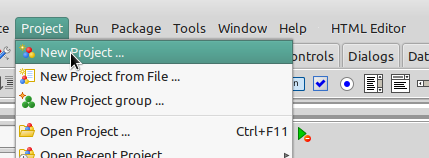
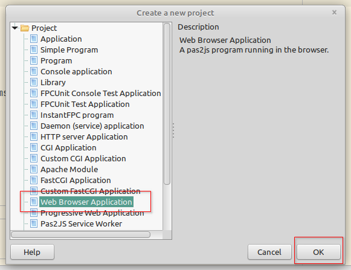
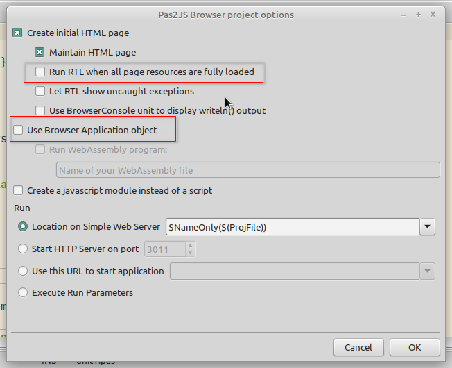

# Web Browser Application

1. Escolha a opção Project/New Project ... 



2. Selecione Web Browser Application e clique em OK. 


2. Marque as opções *Run RTL when all page resources are fully loaded*
   e *Use Browser Application object*.
 

Você terá um esqueleto de programa em Pascal (`project1.lpr`) como este:

``` pascal linenums="1"
program Project1;

{$mode objfpc}

uses
  BrowserApp, JS, Classes, SysUtils, Web;

type
  TMyApplication = class(TBrowserApplication)
  protected
    procedure DoRun; override;
  public
  end;

procedure TMyApplication.DoRun;
begin
  // Your code here
end;

var
  Application : TMyApplication;

begin
  Application := TMyApplication.Create(nil);
  Application.Initialize;
  Application.Run;
end.
```

Veremos o que fazer com ele na próxima etapa. Também será criado um
HTML (`project1.html`) com o seguinte conteúdo.

``` html linenums="1"
<!doctype html>
<html lang="en">
<head>
  <meta http-equiv="Content-type" content="text/html; charset=utf-8">
  <title>Project1</title>
  <meta name="viewport" content="width=device-width, initial-scale=1">
  <script src="project1.js"></script>
</head>
<body>
  <script>
    window.addEventListener("load", rtl.run);
  </script>
</body>
</html>
```
